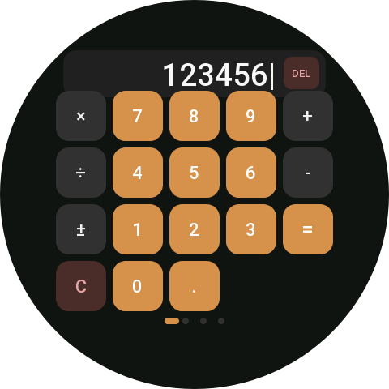
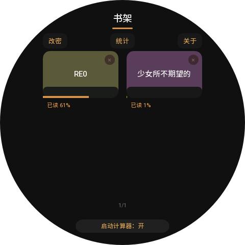
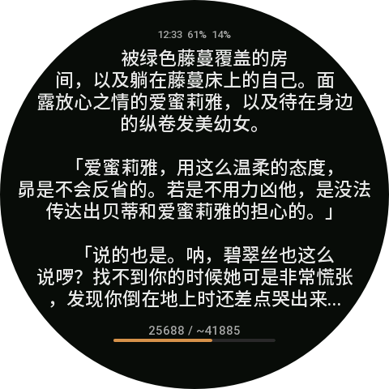
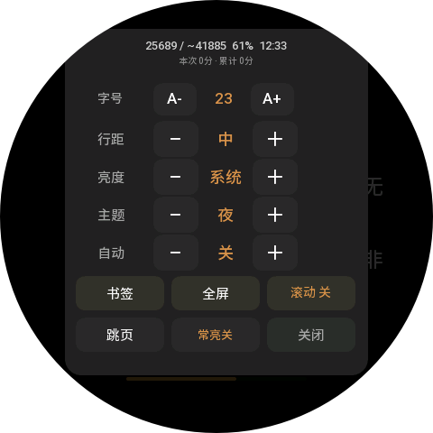

<p align="center">
  
</p>

<h1 align="center">Ring Reader</h1>

<p align="center">A local TXT reader for round-screen Amazfit watches running Zepp OS, with a working scientific calculator as its default entry point.</p>

<p align="center">
  <a href="#features">Features</a> ·
  <a href="#screenshots">Screenshots</a> ·
  <a href="#send-books-from-your-phone">Send Books</a> ·
  <a href="#development">Development</a> ·
  <a href="./README.md">中文</a>
</p>

> [!NOTE]
> Version `3.2.0` · App ID `1121557` · Requires Zepp OS 3.0 or later.

## Features

### Calculator entry

- Opens as a dark scientific calculator with arithmetic, powers, factorials, trigonometric and logarithmic functions, and unit conversions.
- Supports paged keys, expression editing, cursor movement, and calculation history.
- Enter the default password `123456` and press `=` to open the bookshelf. Change it later from the bookshelf to a 4-8 digit password.

> [!WARNING]
> The password only switches pages inside the app. It is not encryption, privacy protection, or access control.

### Local reading

- Includes a sample text and reads UTF-8 `.txt` files sent from the phone.
- Remembers reading position, theme, font size, line spacing, brightness, auto-turn settings, and scroll mode.
- Includes eight reading themes: Night, Eye Care, Paper, Black, Dusk, Fog, Autumn, and Ice.
- Offers 12-36 point fonts, four line-spacing levels, brightness controls, screen-always-on mode, and auto-turn speeds.
- Handles four-byte UTF-8 characters and lays out text line by line against the usable chord width of a round screen.

### Navigation and bookmarks

- Tap the left or right side of the text to turn pages, or use line-by-line scroll mode.
- Shows a progress bar and percentage, and supports page or percentage jumps, bookmarks, and bookmark navigation.
- Tracks total reading time, today's reading time, book progress, and a seven-day reading trend.
- Digital Crown rotation changes pages or scrolls one line at a time. Devices with directional hardware keys can use `UP` and `DOWN` for the same navigation.

### Phone-to-watch transfer

- Enter a book title and a direct UTF-8 TXT download URL in the Zepp app settings page.
- The companion side downloads books in a queue and sends them to the watch through BLE `TransferFile`.
- Download and transfer progress appears during the operation. Failed jobs release the active queue item so later jobs can continue.
- The bookshelf lists received books, supports long-press deletion, and shows reading statistics.

## Screenshots

<table>
  <tr>
    <td width="50%" align="center">
      <br>
      <sub><b>Calculator entry</b><br>Everyday calculations and paged scientific functions</sub>
    </td>
    <td width="50%" align="center">
      <br>
      <sub><b>Bookshelf</b><br>Recent reading, progress, and book management</sub>
    </td>
  </tr>
  <tr>
    <td width="50%" align="center">
      <br>
      <sub><b>Reader</b><br>Round-screen-aware layout and reading progress</sub>
    </td>
    <td width="50%" align="center">
      <br>
      <sub><b>Reading menu</b><br>Typography, themes, auto-turning, and bookmarks</sub>
    </td>
  </tr>
</table>

## Supported Devices

`app.json` currently declares support for these round-screen Amazfit devices:

| Device family | Design resolution | Input |
| --- | ---: | --- |
| Amazfit Balance | 480 x 480 | Digital Crown, touch, directional keys when available |
| Amazfit T-Rex 3 | 480 x 480 | Touch, directional keys when available |
| Amazfit Cheetah Pro | 480 x 480 | Digital Crown, touch, directional keys when available |
| Amazfit GTR 4 | 466 x 466 | Digital Crown, touch, directional keys when available |
| Amazfit Active 2 | 466 x 466 | Digital Crown, touch, directional keys when available |

> [!TIP]
> Digital Crown handling follows Zepp OS `KEY_HOME` events with a non-zero `degree`: the app responds directly to rotation direction and ignores Crown presses for reader navigation.

## Getting Started

### Open the bookshelf

1. Open the app. It starts on the calculator page.
2. Enter `123456`, then press `=`.
3. After your first visit, change the password from the Change Password control at the top of the bookshelf.

### Read and adjust settings

1. Select a book from the bookshelf.
2. Tap the page number area at the bottom to open the menu.
3. Adjust font size, line spacing, brightness, theme, auto-turning, scroll mode, and screen-always-on mode.
4. Open Bookmarks to manage bookmarks at the current location. Use Jump to move to a page or percentage.

## Send Books From Your Phone

1. In the Zepp app, open **Profile > My Device > Ring Reader > App Settings**.
2. Enter a title and paste a direct URL to a UTF-8 `.txt` file.
3. Select **Upload to Watch**, keep the Zepp app in the foreground, and keep the watch connected.
4. Open the bookshelf on the watch and wait for the transfer to finish.

> [!WARNING]
> Only direct-download UTF-8 TXT files are supported. Browser preview URLs, authenticated URLs, restricted redirects, and files with other encodings may fail to download or display correctly.

## Development

### Prerequisites

- A current Node.js LTS release
- A Zepp OS development environment
- Access to an npm registry

### Install dependencies

```bash
npm ci
```

### Build the package

```bash
npm run build
```

The generated `.zab` package is written to `dist/`. On Windows, you can also run:

```bat
build.cmd
```

### Preview with Zeus

```bash
npm run preview
```

## Project Layout

```text
app.js                 # Watch-side TransferFile receiver, queue draining, and book registration
app-side/index.js      # Phone-side TXT downloads, transfer queue, and BLE TransferFile sender
page/calculator.js     # Default calculator, scientific functions, history, and bookshelf entry
page/bookshelf.js      # Bookshelf, deletion, statistics, receiving status, and settings entry
page/reader.js         # TXT layout, reading, bookmarks, progress, menu, and reading time
setting/index.js       # Zepp app settings page and book-transfer form
utils/crown.js         # Shared Digital Crown and directional-key input logic
docs/images/           # README screenshots
```

## Verification

```bash
npm test
npm ci --dry-run
npm run build
```

`npm test` runs the Digital Crown and directional-key regression test. The build compiles the app pages and device-specific assets.
